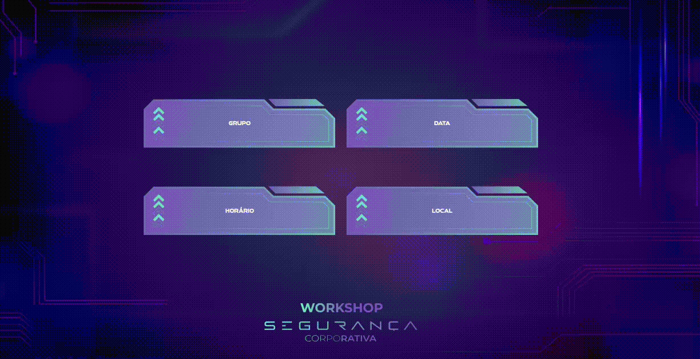
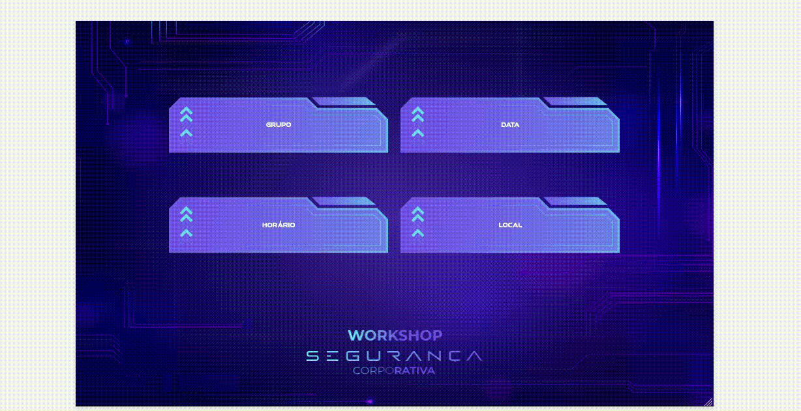

# Workshop Segurança Corporativa 🕵️‍♀️

Esse projeto foi desenvolvido para ser um convite para um workshop de segurança corporativa da empresa **GF Tech**.

<div style="text-align:center">
  
</div>

<div style="text-align:center">
  
</div>

## Descrição 🔍

O sistema possui duas páginas principais:

1. **Página de Login**:
   - Permite ao usuário selecionar seu nome de um menu suspenso (`select`).
   - O usuário deve inserir uma senha padrão para acessar a próxima página.

2. **Página de Detalhes**:
   - Exibe informações importantes do workshop para o usuário, incluindo:
     - Grupo ao qual o usuário pertence
     - Data do workshop
     - Horário do workshop
     - Local do workshop

## Responsividade 📱
Este projeto foi desenvolvido com foco na responsividade, garantindo uma experiência de usuário consistente em uma variedade de dispositivos, incluindo desktops, tablets e smartphones.

<div style="text-align:center">
  
</div>

<div style="text-align:center">
  
</div>


## Como usar ⁉️
Clique em **<>code**, depois **Download zip**. Extraia os arquivos e abra a pasta ou no VS Code.

Então, execute o seguinte comando no terminal:

```bash
npm run dev
# ou
yarn dev
# ou
pnpm dev
# ou
bun dev
```

Abra [http://localhost:3000](http://localhost:3000) no seu navegador para ver o resultado.

Você pode editar a página modificando o arquivo `app/page.tsx`. A página é atualizada automaticamente conforme você edita o arquivo.

## Tecnologias Utilizadas 💻

- **React**: Biblioteca para construção da interface do usuário.
- **Next.js**: Framework React para renderização do lado do servidor e geração de sites estáticos.
- **Tailwind CSS**: Framework CSS utilitário para estilização.
- **Heroicons**: Biblioteca de ícones para adicionar um ícone de olhinho ao campo de senha.

## Deploy 🔺

Este projeto está publicado e disponível para acesso através da Vercel. Você pode visualizar a aplicação online no seguinte link:

- [Acesse a aplicação na Vercel](https://worshop-seguranca.vercel.app/)

## Contribuidores

- [Mariana Souza](https://www.linkedin.com/in/marianasouza127/) (Design)
- [Bianca Ferreira](https://github.com/Biancafrs) (Dev)
- [Yago Castro](https://github.com/yago-castro-gomes) (Dev)

